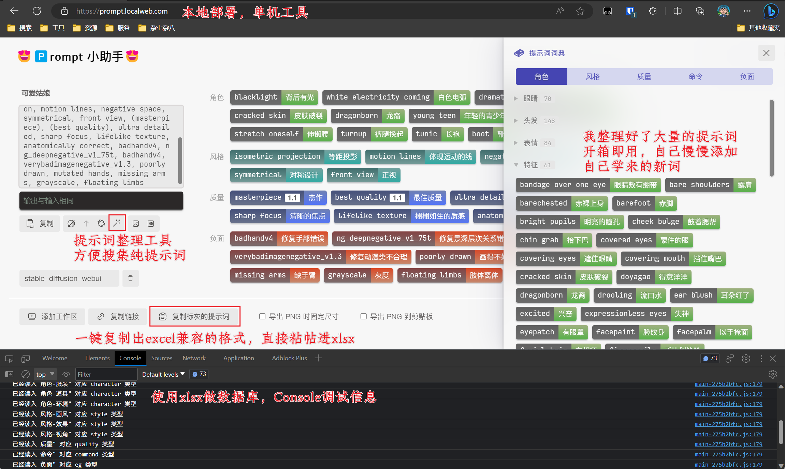

# 单机 😍🅿𝗋𝗈𝗆𝗉𝗍 小助手😍 

## 本工程是 moonvy.com 的 OPS 项目分支

## 提示词小助手 | 可视化编辑提示词

这是一个旨在把 AIGC 提示词（现在支持 Midjourney）可视化并提供编辑功能的工具，有以下特性

-   显示英文提示词的中文翻译
-   翻译输入的中文提示词到英文（因为 Midjourney 仅支持英文提示词）
-   为提示词进行分类（角色、风格、质量、命令、负面）
-   轻松的排序、隐藏提示词
-   把提示词可视化结果导出为图片
-   本地提示词词典，通过 Excel 管理


# 部署
## 准备本地服务器
 - 我使用 apache 官方出品的 XAMPP： https://www.apachefriends.org/
 - 我的 Xampp 安装在 `D:\apps\xampp` 目录,
 - 我的项目clone 在 `D:\Workspace\SDPromptTool`
 - 在 `D:\Workspace\SDPromptTool\dist` 下添加一个 `index.html` 文件，内容为 `test pass`
 - 在 hosts 文件里添加本机域名 `127.0.0.1 prompt.localweb.com`
 - 使用工具生成 https 证书： https://github.com/FiloSottile/mkcert/releases
 - `mkcert-v1.4.4-windows-amd64.exe localhost www.localweb.com hack.localweb.com prompt.localweb.com`
 - 生成完的文件，key文体重命名为 `server.key`，另一个为 `server.crt`，移到 `D:\Apps\Xampp\apache\conf\`
 - 编辑 `D:\Apps\Xampp\apache\conf\extra\httpd-vhosts.conf`, 添加如下内容
```
<VirtualHost *:80>
    ServerAdmin webmaster@localweb.com
    DocumentRoot "D:/Workspace/SDPromptTool/dist"
    ServerName prompt.localweb.com
    ErrorLog "D:/Apps/Xampp/apache/logs/prompt-error.log"
    CustomLog "D:/Apps/Xampp/apache/logs/prompt-access.log" common
</VirtualHost>
<VirtualHost *:443>
    DocumentRoot "D:/Workspace/SDPromptTool/dist"
    ServerName prompt.localweb.com:443
    ServerAdmin webmaster@localweb.com
    SSLEngine on
    SSLCertificateFile "D:/Apps/Xampp/apache/conf/server.crt"
    SSLCertificateKeyFile "D:/Apps/Xampp/apache/conf/server.key"
    ErrorLog "D:/Apps/Xampp/apache/logs/prompt-error.ssl.log"
    CustomLog "D:/Apps/Xampp/apache/logs/prompt-access.ssl.log" common
</VirtualHost>                       
<Directory "D:/Workspace/SDPromptTool/dist">
    Options FollowSymLinks Multiviews Indexes
    MultiviewsMatch Any
    AllowOverride All
    Require all granted
</Directory>
```
 - 重启 apache，浏览器里访问 `https://prompt.localweb.com/` 看到 `test pass`, 说明本地服务器准备好了

## 开始部署
 - `git clone https://github.com/Tairraos/SDPromptTool.git`
 - `cd SDPromptTool`
 - `npm i`
 - `npm run build`
 - 完成，使用域名在浏览器里访问工具
 - 如果需要部署在其它位置，工程内全文搜索 `minifix` 把它指向你将要deploy的位置

## 部署说明
 - 如果 apache 指向的位置不同，要修改 `minifix` 四处
     - 两处是翻译用的代理，我也不知道原工程为什么要写两遍一样的代码
     - 一处是 vue 路由配置，指定自己的根在哪里
     - 一处是 vite build 的时候，要把编译出来的文件拷到指定位置

## 如何修改默认提示词词典
 - 在 web deploy 目录会生成一个 prompt.xlsx，编辑它就可以更新自己的基础 prompt
 - 粘帖别人的 prompt 到工作区，清理，把喜欢的 prompt 都标灰，然后使用复制标灰功能，直接带翻译粘帖到 prompt.xlsx

## 调试
 - 使用 `npm run dev` 调试源代码
     - 此时有 sourcemap 可以直接在浏览器 console 里调试源代码
     - 如果翻译代理不工作, 先 `npm run build` 一次，把翻译代理部署到位
 - 提示词字典显示`未知`分类
     - prompt.xls 里，有些 `prompt` C列 `dir` 为空
 - 加载 Excel 出错
     - 可能是空白行非空，比如有一个空格，程序读到非空行当做数据解析
     - 代码做了容错，检查 console 的输出，看看 xlsx 的哪个位置解析出错
 - npm run build 出错
     - 部署目录的 prompt.xls 正打开着的话，会被 excel 锁定冲突，导致部署失败

# 相对原项目的改变

 - 取消 Node server，换用 apache 服务
     - 翻译 api 跨域调用，需要有服务器代理，本项目使用 php 代理
 - 取消 Notion 库，放弃 Cloud 服务，打造单纯单机工具
 - 使用单个 Excel 代替原版多个 csv 文件的管理方式
     - 原项目使用 csv build json 来使用，不直观，难维护
     - prompt 库放在 web/public/prompt.xlsx
     - build 时会检测部署位置下的 prompt.xlsx 是否比工程中的新
     - 如果部署位置 prompt.xlsx 更新，build 的时候会将它复制到工程
     - 更新的 prompt.xlsx 可跟随工程一并提交到 git repo 里保存
 - 优化翻译机制
     - 缺省使用有道翻译，不需要申请 api key，开箱即用
     - 也可以选择百度翻译，准确性更高，申请地址：https://api.fanyi.baidu.com/
     - 如果选择百度，将 web/public/keys.php.example 改名成 keys.php
     - keys.php 被写在 .gitignore 里，不会被上传到 git, 放心填写隐私 key
 - 增加了清理 prompt 的功能
     - 在界面绿色提示词下方，一个魔术棒图标
     - 清理会去除权重，去除重复，去除非 prompt 指令，留下单纯的prompt
 - 增加了批量复制 prompt 功能
     - 点击下方【复制标灰的提示词】会把标灰的提示词以 Excel 格式复制到剪贴板
     - 打开 prompt.xlsx 可以直接帖进空白的行收集，为提示词添加分类名即可
     - 如果标灰的 prompt 已经存在于 xlsx 里，或者刚刚被复制过，不会再次被复制
 - 增加了未知提示词样式
     - 在 prompt.xlsx 里没有的 prompt 底部会显示一条红线
 - 取消原项目无用的内容
     - 取消引用的外部 webfont，会 build 出来一堆文件，实际本机字体就很好看
     - 取消 legacy build，兼容中古浏览器没必要
 - 扫描了 civitai 的几万个图片 prompt, 添加大量 Prompt
     - 特征 61
     - 姿势 51
     - 上装 24
     - 下装 12
     - 鞋袜 12
     - 帽子 15
     - 饰品 25
     - 环境 88
     - 画风 28
     - 流派 50
     - 出图偏好 28
     - 画面效果 41
     - 图片形式 55
     - 图片视角 47
